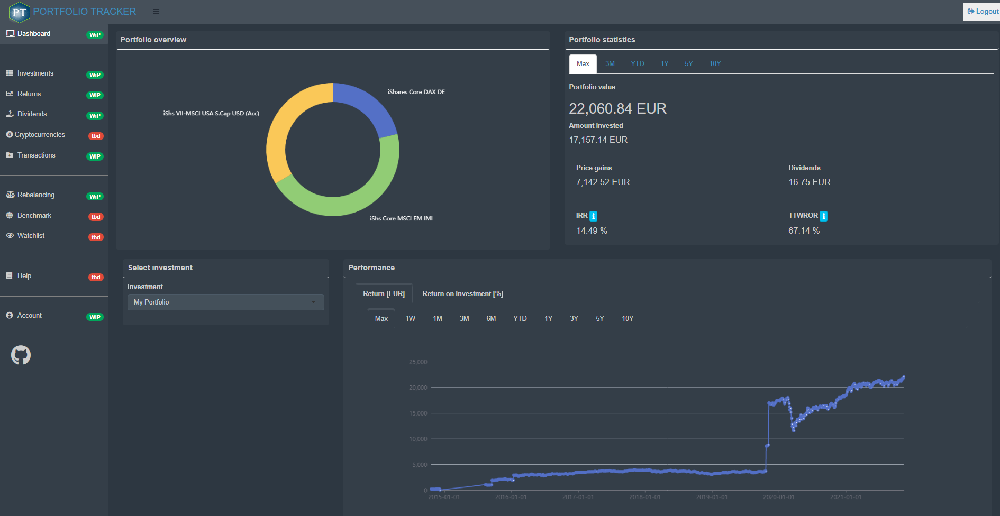

# Documentation of the Portfolio Tracker 

<!-- badges: start -->

<!-- badges: end -->

This is the documentation of the Portfolio Tracker, an app to track your
investment portfolio. The goal of this tool is to provide a complete and
automated workflow from extracting relevant data from your bank
statements to calculating the performance of your investments.

## What does the Portfolio Tracker do? (WIP)

## Example (demo)

## Help (WIP)

**1. How can I add new transactions?** Select the panel *Transactions*
and choose between two different options (add manually or upload PDFs)
in the box on the right hand side.

**2. Which PDF bank statements are automatically read?** Right now, bank
statements from four different banks and brokers are included. See
[here](https://github.com/lorenzbr/BankStatementParser#readme) for
further information. For additional banks submit a suggestion via
<https://github.com/lorenzbr/PortfolioTrackerDocs/issues> and send an
anonymized PDF bank statement to my private address.

**3. What are tickers?** Tickers are symbols for an investment such as
stocks or funds and identifies the investment on a stock market. It is
required to be able to access prices and volume data of an investment.

**4. Why are some tickers missing?** The *Portfolio Tracker* tries to
identify tickers based on the ISIN or WKN and searches for the
corresponding ticker symbol on
[Xetra](https://www.xetra.com/xetra-de/instrumente/alle-handelbaren-instrumente/boersefrankfurt).
In some cases, the correct ticker, which is needed to get prices from
Yahoo Finance, cannot be found. Then, the user needs to search for the
correct ticker on [Yahoo Finance](https://finance.yahoo.com) and add it
in the panel *Transactions*.

**5. How many PDFs with transactions can I upload at once?** You can
upload as many PDFs as possible. This may, however, take some time.
Alternatively, you can start to upload up to 100 transactions (this can
take several minutes) to see whether any issues arise. In the next step,
you can upload the remaining transactions.

**6. What happens if I upload the same PDF transaction several times?**
As long as the file name of the PDF (and all other information in the
PDF) is unique and unchanged, the *Portfolio Tracker* considers such a
transaction as only one single transaction.

## Documentation (WIP)

**Annualized return**  
“An annualized total return is the geometric average amount of money
earned by an investment each year over a given time period.” See
[here](https://www.investopedia.com/terms/a/annualized-total-return.asp)
for further details.

**Annual return**  
“The annual return is the return that an investment provides over a
period of time, expressed as a time-weighted annual percentage.” See
[here](https://www.investopedia.com/terms/a/annual-return.asp) for
further details.

## Tasks (WIP)

-   [x] Portfolio performance
-   [x] Portfolio statistics
-   [ ] Return on investment (portfolio + individual stocks)
-   [ ] Benchmark with alternative investments (e.g. MSCI World)
-   [ ] Dividends by stock/fund and compute dividend yield
-   [ ] Documentation/vignette/help panel
-   [ ] Watchlist
-   [ ] Cryptocurrencies

## Contact

Please submit bug reports and suggestions via
<https://github.com/lorenzbr/PortfolioTrackerDocs/issues>

## License

This R package is licensed under the GNU General Public License v3.0.

See
[here](https://github.com/lorenzbr/PortfolioTrackerDocs/blob/master/LICENSE)
for further information.
